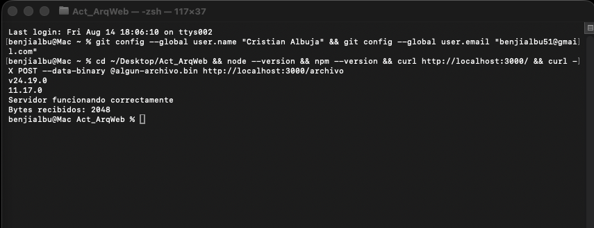
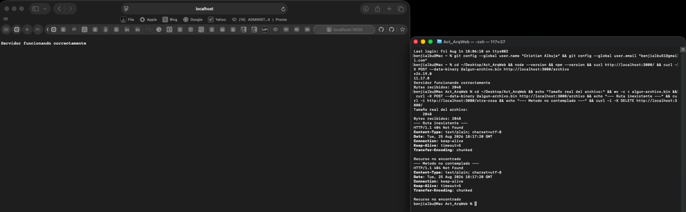

# Evidencia de pruebas — Módulo 1

Salida real de los comandos ejecutados contra el servidor.

## Capturas de pantalla

### Verificación de la instalación de Node.js

Versiones instaladas (Node.js v24.19.0 LTS, npm 11.17.0) y primera prueba de las
dos rutas del servidor.



### Pruebas completas con curl

Tamaño real del archivo (`2048`) contrastado contra el conteo devuelto por el
servidor, respuestas `404` para ruta inexistente y para método no contemplado, y
el servidor respondiendo a un navegador real en `http://localhost:3000`.



## Registro de texto
### Verificación de la instalación

```
$ node --version
v24.19.0
$ npm --version
11.17.0
```

### Archivo de prueba

```
$ wc -c < algun-archivo.bin
2048
```

### GET / — responde 200

```
$ curl -i http://localhost:3000/
HTTP/1.1 200 OK
Content-Type: text/plain; charset=utf-8
Date: Tue, 25 Aug 2026 17:47:27 GMT
Connection: keep-alive
Keep-Alive: timeout=5
Transfer-Encoding: chunked

Servidor funcionando correctamente
```

### POST /archivo — cuenta los bytes del payload

```
$ curl -i -X POST --data-binary @algun-archivo.bin http://localhost:3000/archivo
HTTP/1.1 200 OK
Content-Type: text/plain; charset=utf-8
Date: Tue, 25 Aug 2026 17:47:27 GMT
Connection: keep-alive
Keep-Alive: timeout=5
Transfer-Encoding: chunked

Bytes recibidos: 2048
```

### Ruta inexistente — responde 404

```
$ curl -i http://localhost:3000/otra-cosa
HTTP/1.1 404 Not Found
Content-Type: text/plain; charset=utf-8
Date: Tue, 25 Aug 2026 17:47:27 GMT
Connection: keep-alive
Keep-Alive: timeout=5
Transfer-Encoding: chunked

Recurso no encontrado
```

### Método no contemplado — responde 404

```
$ curl -i -X DELETE http://localhost:3000/
HTTP/1.1 404 Not Found
Content-Type: text/plain; charset=utf-8
Date: Tue, 25 Aug 2026 17:47:27 GMT
Connection: keep-alive
Keep-Alive: timeout=5
Transfer-Encoding: chunked

Recurso no encontrado
```
